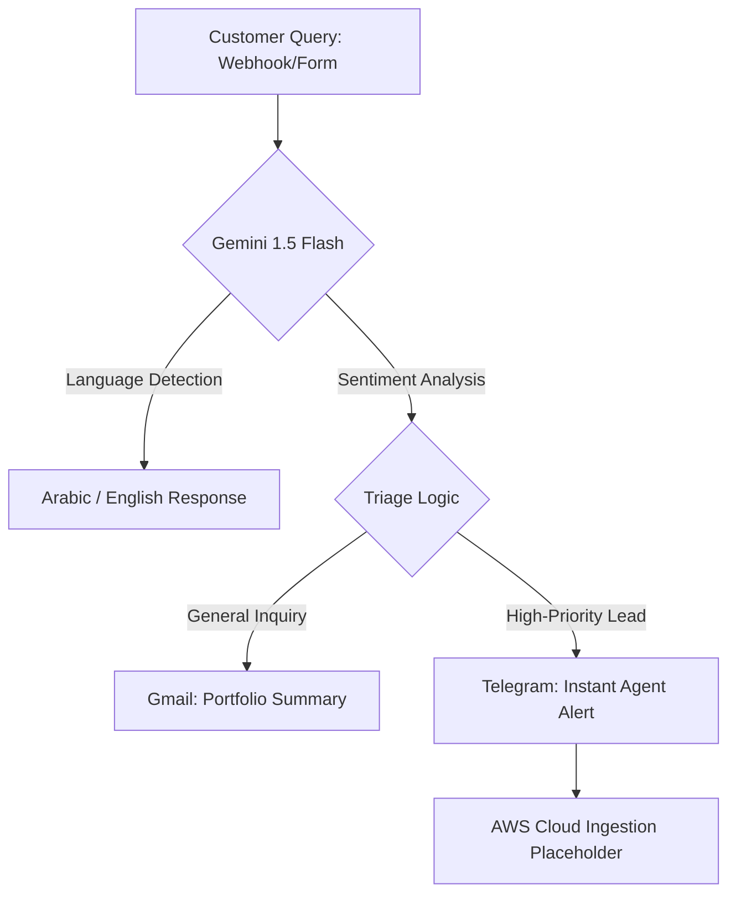

# 🇦🇪 Lukman Abdulhaq | AI Operations & Data Engineer
### Autonomous Workflows • Generative AI • Scalable Cloud Architectures

## 🎥 Featured Project: Dubai Real Estate AI Agent

  <video src="https://raw.githubusercontent.com/lukmanabdulhaq/lukmanabdulhaq/main/demo.mp4" width="100%" controls muted autoplay loop></video>

## 🏗️ Technical Architecture

### 📊 System Evidence
| Architecture Layout | Multilingual AI Response | Real-time Alert |
| :--- | :--- | :--- |
|  |  |  |

---
*Certified by AWS in Machine Learning and GenAI (Feb 2026)*
